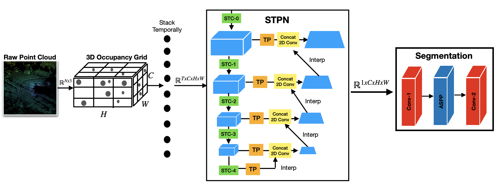

    <video autoplay="autoplay" src="../images/NetworksFast.mp4" controls="controls" width="100%" />

## Overview
We design a real-time dense local semantic mapping algorithm, MotionSC as a benchmark of semantic scene completion on the CarlaSC dataset. Besides, we also run the state-of-the-art semantic scene completion solutions such as SSCNet, SSCNet-Full, LMSCNet and JS3CNet. You can find our implementation of SSCNet, SSCNet-Full and LMSCNet on the [3DMapping repository](https://github.com/UMich-CURLY/3DMapping). Our implementation of [JS3CNet](https://github.com/yanx27/JS3C-Net) can be found on our [forked JS3CNet](https://github.com/Song-Jingyu/JS3C-Net). The video of running the four different models are shown above. We will also include the introduction on MotionSC and some training logs in this page.

## MotionSC

Proposed MotionSC network. A Spatio-Temporal Pooling Network backbone performs SSC using temporal information in real-time. The shrinking dimension of the rectangular prism indicates the temporal axis being squeezed from size T to size 1 through max pooling in the temporal pooling (TP) layer. Consecutive occupancy grids are maintained in a temporal stack, so there is no additional computational overhead from maintaining additional data across time. 

The MotionSC network achieved both accurate and real-time performance. More details can be found in the figure below and in our paper.

## Training Logs

* Link
* How to use

## Visualization
