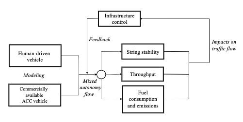

I am particularly interested in the following open challenges:

Theory: 

* Traffic flow theory

* Control systems

* Optimization

Applications:

* Impacts of  heterogenous vehicle driving behavior

* Traffic estimation and control
  

My Ph.D. research mainly includes three parts: 1) developing high-fidelity and physically-interpretable models for AVs and human-driven vehicles to accurately describe vehicle dynamics; 2) exploring the impacts of partially automated vehicles on human-piloted traffic flow, including string stability, highway throughput, and fuel consumption and emissions; 3) designing effective traffic control strategies to account for the influences of mixed autonomy traffic in order to build smart cities. Iteratively, the impacts of the regulated traffic flow are re-evaluated, and the infrastructure control strategy is further developed with advanced control approaches.

Some of my recent works are briefly summarized below.

<h2>1. Developing Physically-interpretable Models for Traffic Flow Dynamic</h2>

My research is focused on developing physically-interpretable car following models to accurately describe ACC vehicle dynamics in order to obtain accurate and realistic analysis results on traffic flow characteristics, including stability, highway throughput, fuel consumption and emissions. My contributions include:

*	Developed accurate and physically interpretable microscopic car-following models to capture the asymmetric driving behavior of commercially available ACC vehicles
 
* Calibrated car following model parameter values with the Vanderbilt ACC car following datasets and utilized the interior-point algorithm to optimize the discrepancy between simulated trajectories and real data 

* Simulated and conducted model performance comparisons with statistical methods (e.g., F-test) using Matlab

<h2>2. Investigating how commercially available ACC vehicles will impact traffic.</h2>

Utilizing the accurate microscopic car-following models for ACC vehicles, my research contributes to investigating how commercially available ACC vehicles will impact mixed autonomy traffic with human-piloted vehicles at different market penetration rates.  My contributions include:

*	Conducted analytical and numerical string stability analyses by linearizing the nonlinear ODE for mixed traffic consisting of ACC vehicles and human-driven vehicles
  
* Utilized Simulation of Urban Mobility (SUMO) for highway capacity analysis and employed the Traffic Control Interface (TraCI) in Python to facilitate the simulations
  
* Modeled and estimated the impacts of ACC vehicles on fuel consumption and emissions through simulations conducted in MATLAB

<!--
<em>Related articles:</em>
1. M. Shang, B. Rosenblad, and R. Stern. A novel asymmetric car following model for driver-assist enabled vehicle dynamics. <em>IEEE Transactions on Intelligent Transportation Systems</em>, 23(9):15696–15706, 2022

2. 
-->
