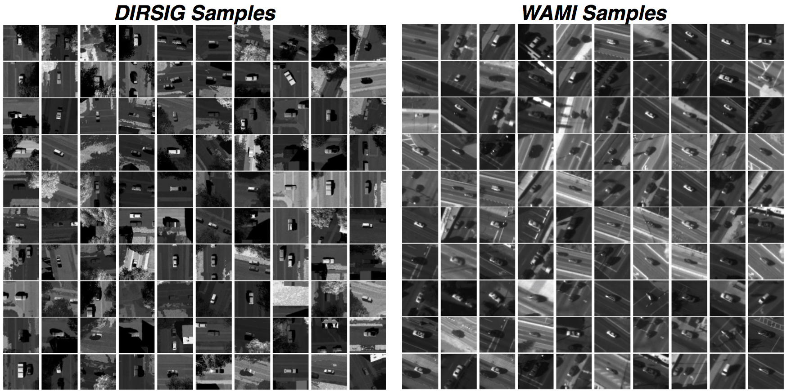



- We released our dataset, **Synthetic Aerial Vehicle Classification Dataset**, to the research community. Our dataset consists of *55227* samples of *48x48* px images from an aerial platform generated by the *Digital Imaging and Remote Sensing Software (DIRSIG)*. It has two classes : (1) **vehicle**, and (2) **background**. Overall, there are *27613* samples of vehicle images and *27613* samples of background images. The Ground Sampling Distance in this dataset are tuned to *0.3m* on average as we target vehicle detection/classification in the *Wide Area Motion Imagery (WAMI)* platform. You can find some positive samples from DIRSIG generated dataset and WAMI dataset in the figure below. Our goal by releasing this dataset is to avoid splitting a single video captured from the WAMI platform to form a training and validation dataset as it results in *overfitting*. Please cite our paper if you use this dataset for research purposes.

	- [DIRSIG generated training images and WAMI validation images](https://drive.google.com/open?id=1cQIM2a7gNaxlE2oFdQ_O-GqgBo84fLia)
		- The dataset is split into two folders :
			- **train_dirsig** that includes synthetic images and a text file containing the labels of the training samples.
			- **validation_wami** that includes 600 WAMI images and a text file containing the labels of the validation samples.

	

	<pre>
	@article{uzkent2017tracking,
		title={Tracking in Aerial Hyperspectral Videos using Deep Kernelized Correlation Filters},
		author={Uzkent, Burak and Rangnekar, Aneesh and Hoffman, Matthew J},
		journal={arXiv preprint arXiv:1711.07235},
		year={2017}
	}
	</pre>

- We released our dataset, **A Synthetic Aerial Hyperspectral Video for Vehicle Tracking**, to the aerial tracking research community. This video contains *157* frames captured from an aerial platform generated by the *Digital Imaging and Remote Sensing Software (DIRSIG)*. The average ground sampling distance in the video is *0.3m* and the frame rate is set to be *1.42 fps*. You can find the full video below. Our dataset also comes with the ground truth locations of the vehicles in the video. Please cite our paper if you this dataset for research purposes. For more information, we refer the readers to our paper shown below and our previous papers you can find in the [publications](https://buzkent86.github.io/publications/) section.

	- Download Hyperspectral Frames
	```shell
	wget https://drive.google.com/a/g.rit.edu/uc?id=0B3lpS7qMFUmwTUQwaUpiOVN2SDA&export=download
	```
	- Download ReadMe and Ground Truth for Vehicles
	```shell
	wget https://buzkent86.github.io/datasets/GroundTruth.zip
	```
	- [Aerial Vehicle Tracking Video](https://www.youtube.com/watch?v=-1-9WZH0Ki4)

	<pre>
	@inproceedings{uzkent2016real,
	  	title={Real-time vehicle tracking in aerial video using hyperspectral features},
	  	author={Uzkent, Burak and Hoffman, Matthew J and Vodacek, Anthony},
	 	booktitle={Proceedings of the IEEE Conference on Computer Vision and Pattern Recognition Workshops},
	  	pages={36--44},
	  	year={2016}
	}
	</pre>
