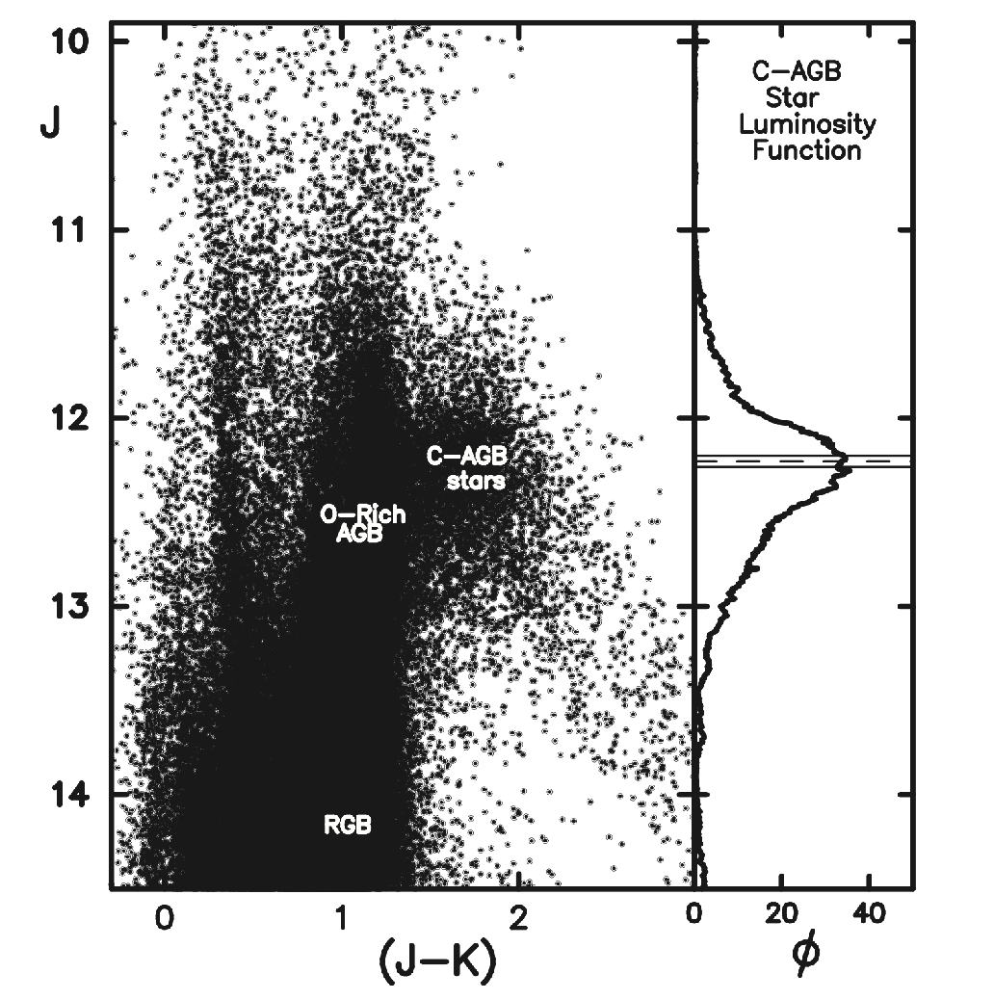

The JAGB Method
======

Measuring the Hubble constant (H0), precisely and accurately, has remained a challenging problem in astronomy. H0 parameterizes the current expansion rate of the universe, and together with measurements of the cosmic microwave background (CMB) radiation, provides a powerful constraint on the standard model of cosmology. 
Because of its significance, the value of H0 has undergone intense scrutiny and re-determination over the past few decades. Currently, early universe measurements of H0 inferred from the measurements of the power spectra of temperature and polarization anisotropies of the CMB appear to differ by 4-6 sigma from measurements directly measured by late-time universe distance ladders.  This discrepancy leads to the following questions: Are the systematic errors of individual measurements causing the Hubble tension, or do we need to reform the standard ΛCDM physics model so that early-time predictions and late-time observations of H0 converge? 

I am currently developing a new distance indicator, the J-region Asymptotic Giant Branch (JAGB) method, for use in a cosmic distance ladder to measure the Hubble constant to high precision and accuracy. A new and independent measurement of H0 via the JAGB method may help shed light on the Hubble tension. The JAGB method capitalizes on the luminosity function of JAGB stars, a photometrically distinct class of thermally-pulsating AGBs. During pulsations, or ‘dredge-up’ events, the star’s convective zone penetrates deep into the helium-fusing shell, bringing carbon to the surface, thus making the star appear redder than AGBs that have not yet had deep enough ‘dredge-up’ events. The JAGB method as a distance indicator is extremely simple: in the J band, the luminosity function of J-region stars (distinguished by their (J – K) or (J – H) color) peaks at a constant magnitude, which can be used as a standard candle. For example, in the figure above, the horizontal line at J = 12.27 represents the mean apparent magnitude of the JAGB luminosity function for the LMC. The JAGB stars are easily
identifiable by their red colors.

In my latest paper, [Lee et al. (2021)](https://iopscience.iop.org/article/10.3847/1538-4357/abd253), I led a project to measure the distance to the Wolf-Lundmark-Melotte Galaxy using four different methods: the recently developed JAGB method, the near-infrared TRGB, the optical TRGB, and Cepheids. This was the first study comparing all four methods. I showed that the JAGB method is competitive with other local distance indicators in accuracy and precision.