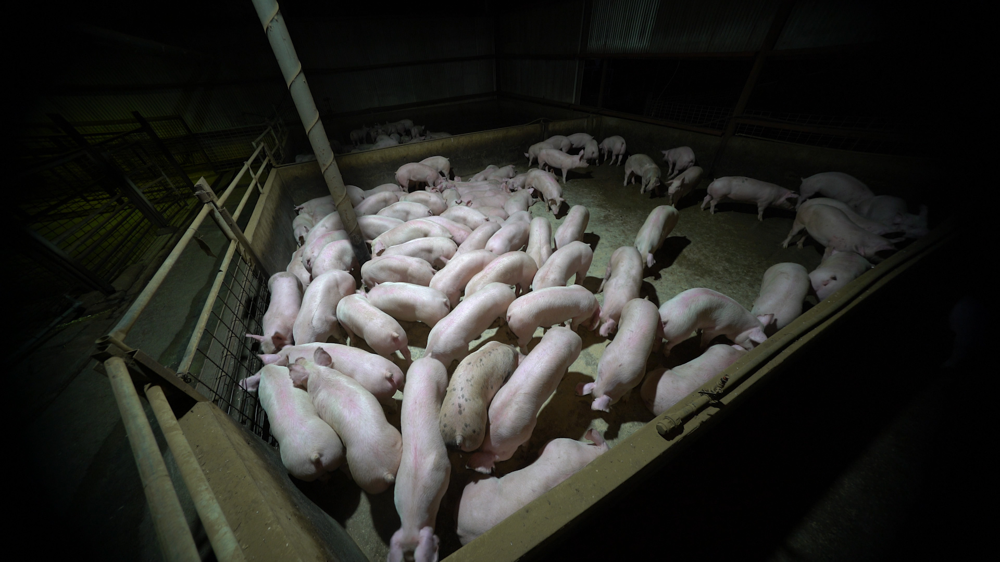
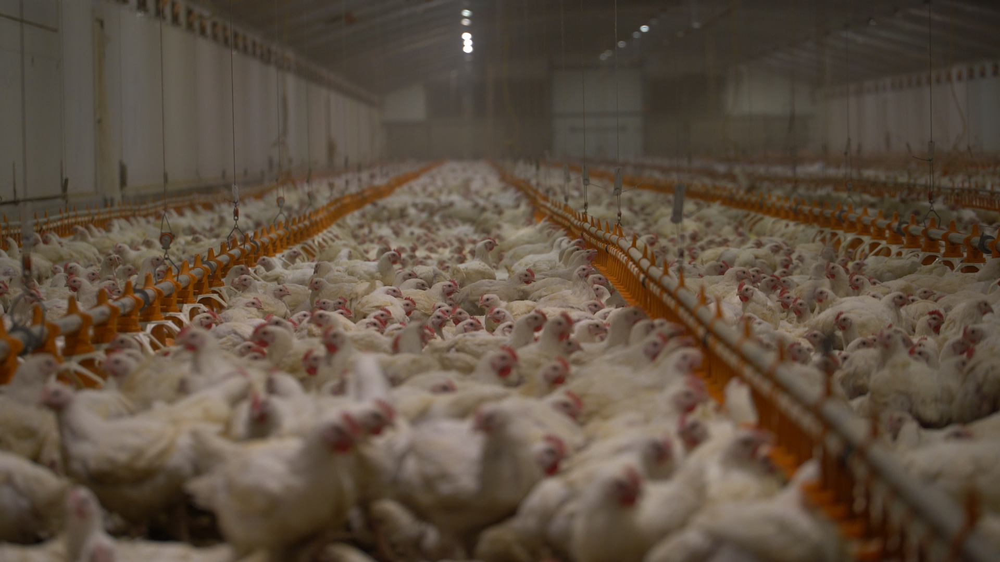
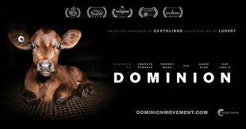

I feel very strongly about animal rights and ending climate change. One of my life goals is to see the end of animal agriculture and factory farms, both of which contribute heavily to climate change. We can make huge leaps and bounds by adopting vegan and plant-based diets. Going vegan was the best decision of my life, and I am so happy to have saved thousands of animals lives as well as billions of gallons of water and carbon emissions. So why _exactly_ should one go vegan? Here are only a few (of many) reasons that convinced me: 

Environmental Reasons for being Vegan
====== 
It is simply paradoxical to be both an environmentalist and still eat meat. Eating animal products is no longer sustainable. The US government heavily subsidizes the animal agricultural industry due to their wealthy lobbyists, which is why meat is so cheap (1). Raising animals for food requires massive amounts of land, food, energy, and water. 
1. **Animal agriculture uses up insane amounts of land and fresh water resources**: According to scientists at the Smithsonian Institution, seven football fields’ worth of land is bulldozed every minute to create more room for farmed animals and the crops that feed them (2). Of all the agricultural land in the U.S., 80 percent is used to raise animals for food and grow grain to feed them—that’s almost half the total land mass of the lower 48 states. Chickens, pigs, cattle, and other animals raised for food are the primary consumers of water in the U.S.: a single pig consumes 21 gallons of drinking water per day, while a cow on a dairy farm drinks as much as 50 gallons daily. It takes more than 2,400 gallons of water to produce 1 pound of cow flesh, whereas it takes about 180 gallons of water to make 1 pound of whole wheat flour.
2. **Animal agriculture is very much to blame for global warming and greenhouse gases**: Producing a little more than 2 pounds of beef causes more greenhouse-gas emissions than driving a car for three hours and uses up more energy than leaving your house lights on for the same period of time. (3) **According to the United Nations, a global shift toward a vegan diet is one of the steps necessary to combat the worst effects of climate change. (4)**  A California study found that a single dairy cow “emits 19.3 pounds of volatile organic compounds per year, making dairies the largest source of the smog-making gas, surpassing trucks and passenger cars.”
3. **Animal agriculture and Water Pollution**: Each day, factory farms produce billions of pounds of manure, which ends up in lakes, rivers, and drinking water. The one trillion pounds of waste produced by factory-farmed animals each year are usually used to fertilize crops, and they subsequently end up running off into waterways—along with the drugs and bacteria that they contain.  2006 report by the National Oceanic and Atmospheric Administration found that the Gulf of Mexico’s “dead zone”—an area in which virtually all the sea animals and plants have died—is now half the size of Maryland.16 In 2006, a separate study by Princeton University found that a shift away from meat production—as well as Americans’ adoption of vegetarian diets—would dramatically reduce the amount of nitrogen in the Gulf to levels that would make the dead zone “small or non-existent.”
4. **The oceans will be dead by 2048 from pollution and over-fishing** (6): Eating fish is not sustainable. Over-fishing creates huge caps in the ocean's food chains and biodiversity, crashing ecosystems all over the ocean. 

Ethical Reasons for being Vegan
======
Cows, pigs, fish, chickens, and other animals that often wind up on plates have emotions, just like you and me. They experience love, grief, and fear. 

- **Pigs** have the emotional capacity and intelligence of 5-year-old humans. Yet they are stuffed into pens with so little moving room for their entire lives, that their muscles atrophy. Pigs are beaten brutally every day. Once impregnated, the sows are confined to gestation crates, typically 2’x7’, for up to four months until their offspring are born. The floors of these crates are slatted so that urine and feces can fall through. There is no bedding, even straw, for the animals to rest on. To avoid the behavior known as tail-biting, newborn piglets have their tails docked near the base without the use of anesthesia. Newborn piglets often have their ears notched and teeth removed, again without anesthesia. Ammonia fumes rise to dangerous, uncomfortable levels due to high concentrations of waste. Most pigs never see sunlight their entire life until slaughter. 

- **Cows** are over-fed to the point of extreme obesity. Unnaturally high milk production can lead to mastitis, a painful bacterial infection of a cow’s udder. Dairy cows often have up to two-thirds of their tails and their horns removed without painkillers. Just as with humans, cows only produce milk as a side effect of giving birth. To keep the milk flowing, dairy farms artificially inseminate cows once a year. Their gestation period lasts nine months, so the majority of most dairy cows’ lives are spent pregnant. When a calf is born, he or she is removed from the mother—generally that same day—to make the mother’s milk available for collection. This can be hugely traumatic to mother cows and to their calves.

-  **Chickens**: Approximately 9 billion chickens are killed for their meat every year, while another 300 million chickens are used in egg production. Nearly all meat chickens are raised indoors in large sheds containing 20,000 chickens (or more) crowded together on the shed floor. Due to the high concentration of birds living atop of their own waste without adequate ventilation, high ammonia levels develop—irritating eyes, throats and skin. Modern chickens look very little like their wild chicken ancestors. Thanks to selective breeding—combined with low-dose antibiotics, excessive feeding and inadequate exercise—most industrially raised meat chickens grow unnaturally quickly and disproportionately. While their breasts grow large to meet market demand, their skeletons and organs lag behind. Many suffer heart failure, trouble breathing, leg weakness and chronic pain. Some cannot support their own weight and become crippled, unable to reach food and water. The roughly 330 million egg-laying hens [PDF] in the U.S. are mostly raised in long, windowless sheds containing rows of stacked “battery cages.” Up to 10 hens are packed together in one wire cage roughly the size of a file drawer. The frustration of living in such unnatural conditions leads to abnormal pecking behavior and cannibalism. To “fix” this problem, the industry burns or cuts off a portion of hens’ sensitive beaks. Since eggs are laid only by females, what happens to the males? Half of the chicks hatched in this industry are male, but there’s no market for male chicks born with egg-layer genetics since they’re slow-growing and lanky, so they are killed at the hatchery.

- **Fish**: There is a common misconception that fish and other aquatic vertebrates do not feel pain; however, studies demonstrate that they are sentient and capable of both fear and suffering. As on industrial land-based farms, farmed fish are often housed in overcrowded conditions ripe for injury, disease transfer and stress. As there are no regulations around the humane treatment of fish, they most often are not stunned before slaughter, meaning that they are fully conscious. They are killed by bleeding out, blunt force, suffocation or freezing.

- I highly highly recommend watching the documentary "Dominion," which does an excellent job of explaining and showing the extreme cruelty that animals have to endure in animal agriculture. It is not just factory farms that enact this violence. Most farms that claim to be "free-range" have have little to no improvements over typical factory farms, as there are almost zero requirements for being labelled as "free-range."

In addition, there are a myriad of actions one can take to reduce the overall suffering of animals in the world. Here are just a few:
- Go vegan
- Stop visiting zoos & circuses with animals
- Stop buying wool/cashmere/down/fur 
- Don't support SeaWorld

Resources
======
Going vegan can be extremely intimidating at first. But in the end, it is a much better decision for the planet, animals, and your health. Veganism has been shown to reduce cardiovascular disease, cancer, and diabetes (5). Here are a couple of resources that I found extremely helpful in transitioning to a vegan diet: 

**Books**
- Animal Liberation, by Peter Singer: Peter Singer explains 'speciesm'; why do humans think they have more right to the earth and its resources than other animals? And other thought-provoking philosophical questions. 
- The Joyful Vegan, by Colleen Patrick-Goudreau: a great intro for new vegans on tips for staying vegan, as well as many 'counterarguments' towards 'excuse-itarians' (people who still justify eating animals to themselves

**Podcasts**: 
- Food for Thought, Colleen Patrick-Goudreau: again, a great into for new vegans. There is a huge collection of podcasts that I found immensely helpful. Some of the questions she helps answer are: What about 'ethically-raised' meat or dairy? What do I do in social situations as a vegan? Can I still eat fish?

**Documentaries**:
- Dominion: An amazingly well-produced documentary about the horrors of animal agriculture
- What the Health: Shows the health benefits of a vegan diet
- Game Changers: shows veganism can be great for athletes
- Cowspiracy: exposes the horrible effects animal agriculture has on the environment 

FAQ/Common Misconceptions 
======
And finally, the most frequently asked questions that I get from potential vegans: 

Q: How do I get enough protein on a vegan diet?
- A: It is a common misconception that humans need way more protein than they actually do. I  am a marathon runner and soccer player, and I have never felt a protein deficiency. Humans need on average 50-60 g of protein per day, and I find that I get this easily from beans, tofu, quinoa, nuts/seeds, and protein shakes. 

Q: Veganism is so expensive!
- A: My grocery bill was halved after I became vegan. Beans/rice (which is mostly what I eat) are extremely cheap.  There are many ways to eat vegan without breaking the bank! I am happy to discuss this further if people need tips. 

Sources: 
======
1. [The animal agriculture industry is heavily subsidized by the US government](https://cleantechnica.com/2016/12/19/animal-agriculture-subsidies-threaten-planet/#:~:text=Each%20year%2C%20American%20taxpayers%20subsidize,in%20hidden%20costs%20on%20taxpayers)
2. [Acres of land being bulldozed by the minute for animal agriculture](https://www.sciencedaily.com/releases/2002/01/020115075118.htm)
3. [Meat is murder for the enviornment](https://www.newscientist.com/article/mg19526134-500-meat-is-murder-on-the-environment/)
4. [Assessing the Environmental Impacts of Consumption and Production](https://www.resourcepanel.org/reports/assessing-environmental-impacts-consumption-and-production)
5. [Vegan diet benifits](https://www.healthline.com/nutrition/vegan-diet-benefits)
6. [Climate change in the oceans](https://www.nationalgeographic.com/animals/2006/11/seafood-biodiversity/#:~:text=Unless%20humans%20act%20now%2C%20seafood,humans%20consume%20have%20already%20crashed.)