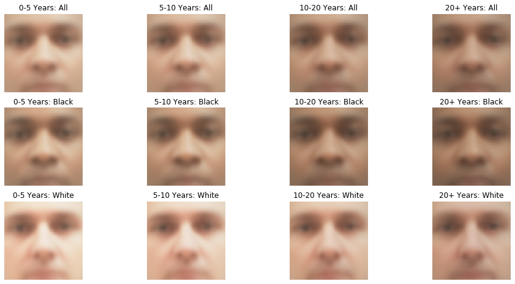

---

## Colorism in Sentencing: 

### Average Inmate by Binned Sentence Length 

Abstract: Utilizing machine learning can help researchers leverage new forms of data, such as photos, to shed light on understudied questions in the social sciences. In this paper, I apply image processing techniques and transfer learning to detect if darker skinned individuals are sentenced to longer prison terms using data from Mississippi prisons. I find that for a one standard deviation increase in skin color, individual sentence length increases by approximately 445 days. Using FaceNet architecture, I create a model to predict the probability an individual is black using his or her prison photo. I find for a one standard deviation increase in probability of black, sentence length increases by approximately 200 days. Both results are largely driven by individuals in the latter part of the distribution of skin tone and probability of black. These results, while not causal, highlight the additional nuances that photo analysis can add to studies of disparate outcomes in the criminal justice system. Beyond criminal justice, this project highlights the potential for machine learning to add insights in the social sciences' study of bias in numerous fields including education, employment, and healthcare.

---

## The Impact of Ideological Diversity on Educational Performance: A Pilot Study 
with Betsy Paluck, Cecilia Rouse, Jason Chin, and John-Henry Pezzuto

Abstract: What is known about the real-world educational effects of ideological diversity in the classroom? Surprisingly, given the amount of attention paid to the role of ideological diversity on higher education outcomes such as critical thinking and academic performance, scant causal evidence exists. We use a lab-in-the-field experiment to test whether the presence of ideologically more conservative students in academic discussion groups, as compared to groups of students who all slanted ideologically liberal, would improve academic outcomes in terms of the quality of each student’s individual academic work. The complete population of an incoming cohort of policy graduate students (N = 78) took part in the experiment. Results demonstrate that students assigned to the ideologically heterogeneous discussion groups subsequently wrote individual assignments that received significantly more negative grades by a professional grader blind to experimental condition and to student identity. Survey results from participating students also suggest that students in the ideologically heterogeneous discussion groups were also significantly more likely to perceive interpersonal conflict and to dislike their group dynamics—a result that was not driven by students of a particular ideological slant. As a small pilot, this study provides questions to resolve with future research, including the role of pedagogy in managing ideological diversity, and provides a template for future experimental designs

Full paper draft found [here](https://psyarxiv.com/y98qx/)